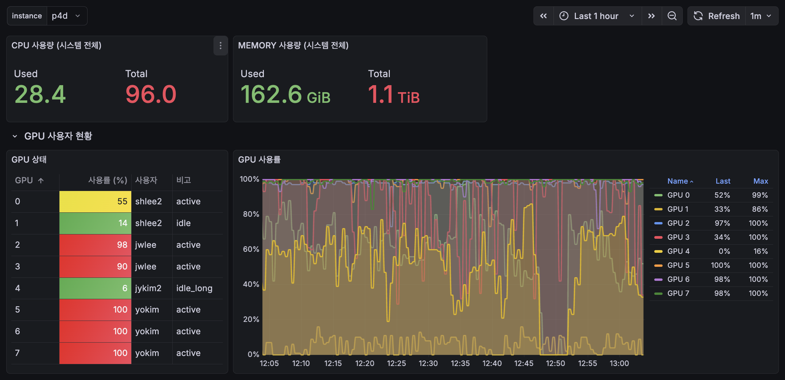
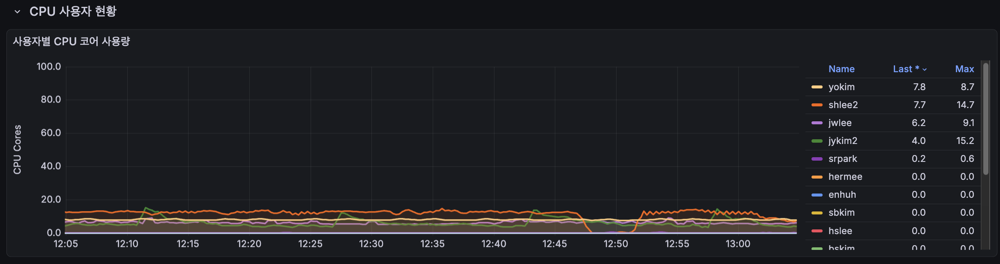
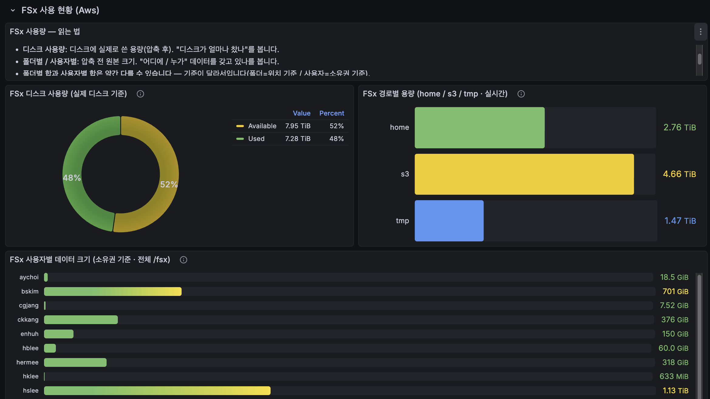

# Mogam Resource Monitoring

모니터링 시스템 전체 구성 파일

## 구조

### central/
중앙 모니터링 서버 (Prometheus + Grafana + Alertmanager + FSx Exporter)
- **위치**: monitoring 인스턴스 
- **포트**: Prometheus 9090, Grafana 3000 (ALB 80)
  - FSx Exporter: 9101
- **URL**: http://mogam-grafana-alb-2031646283.us-west-2.elb.amazonaws.com/d/adv2ww5

### exporters/
각 인스턴스의 메트릭 수집기
- **gpu-instances/**: GPU 인스턴스용 (p4d, p4de, g5, head)
  - dcgm-exporter (GPU 메트릭)
  - node-exporter (시스템 메트릭)
  - process-exporter (프로세스 메트릭)
  - gpu_exporter.py (커스텀 GPU 프로세스 추적)

## 배포

### 중앙 서버
```bash
cd central
docker compose up -d
```

### GPU 인스턴스
```bash
cd exporters/gpu-instances
docker compose up -d
```

## 데이터 보존
- Prometheus: 7일 retention
- Grafana: 영구 (볼륨)
- 백업: central/backups/

---

## Grafana 대시보드

Prometheus에서 수집된 메트릭을 Grafana로 시각화합니다. 인스턴스별(p4d, p4de, g5 등) 필터링이 가능하며 1분 주기로 자동 새로고침됩니다.

### GPU 사용자 현황



- **시스템 요약**: CPU 사용량(Used/Total 코어), Memory 사용량(GiB/TiB) 한눈에 확인
- **GPU 상태 테이블**: GPU 번호별 사용률(%), 점유 사용자, 상태(active/idle/idle_long) 표시
- **GPU 사용률 그래프**: GPU 0~7번 각각의 사용률 시계열 차트 (Last/Max 값 범례 포함)

### CPU 사용자 현황



- **사용자별 CPU 코어 사용량**: 각 사용자가 점유 중인 CPU 코어 수를 시계열로 표시
- 범례에서 Last(현재)/Max(최대) 값으로 사용자별 리소스 점유 현황 파악 가능

### FSx 사용 현황 (AWS)



- **디스크 사용량 (도넛 차트)**: 전체 FSx 볼륨의 실제 디스크 사용률 (압축 후 기준)
- **경로별 용량**: home / s3 / tmp 경로별 실시간 사용량(TiB)
- **사용자별 데이터 크기**: 소유권 기준 `/fsx` 전체에서 사용자별 저장 용량 바 차트
